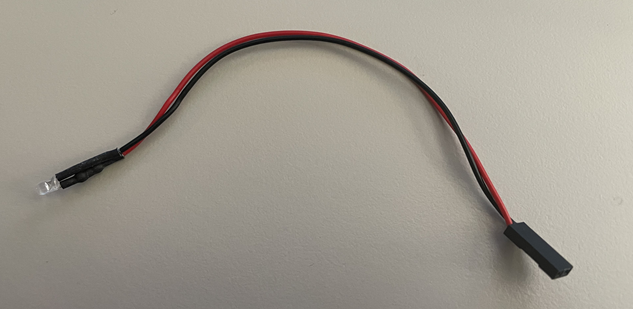

## Navigation

- [Home](../readme.md)
- [Expanded Introduction / Forward](introduction.md)
- [Image Gallery](gallery.md)
- [Materials Required](materials.md)
- [Printing Instructions / Suggestions](printing.md)
- [Assembly](assembly.md)
- [STL Index](../stl/readme.md)

# Assembly
Your case has been printed and you're ready to go- here is how you assemble everything.

## Developer Note
My board in the picture looks scuffed because I've been doing work on it the entire time prototyping. Don't judge me.

## Minimalist Variation Board Prep
This guide is only used to prep boards using the minimalist case variation. If you're using any other variation that has the LEDs and power switch skip this section. **If you're using the minimalist case variation read this section and then skip to the final assembly section.**

All you need to do is bridge P3 and P2 on the board, this will make the board in an always on state when you plug it in.

## Normal Board Prep

You will need to take your flush pin connectors and cut two of them to have:
- 1x 3 Pin
- 1x 2 Pin

And then you will need to solder them to the board as shown in the picture. One is for the power switch and one is for the LED indicator.

## Power Switch Assembly

Here we will be wiring up your switch, I highly recommend coloring the middle pin something different as that is important.

- Measure three pieces of wire from the edge of the mounting hole to the connector, giving some slack so you may easilly insert it later.
- Strip one end of the wire.
- Pre-tin them if you haven't done so.
- Attach each wire to each pin of the switch with solder (Try to be somewhat liberal here).
- Heatshrink the ends to prevent exposure of the conductors.
- Take the other end and strip your wires, tin them, and crimp them with dupont connectors. (If you don't know how to do that please look here: https://www.youtube.com/watch?v=jET1QTP1B7c)
  - Pin 1 and 3 can go on either end.
  - Pin 2 NEEDS to go in the middle. Make sure you confirm this.
- Your power switch is good to go. I recommend testing this while the board is outside of the case.

## LED Assembly

I'm going to assume you bought the pre-wired ones, if you didn't, you know the drill (LED, resistor, heatshrink, etc.).

- Cut the end of the wire without the LED to be short enough to have some slack to connect but not too long.
- Strip and tin your wires.
- Crimp and add a DuPont connector to the end as needed.
- Your LED is good to go, again I recommend testing this  while the board is outside of the case.

## Final Assembly

 - On your GBA motherboard, attach the FFC cables and extensions/replacements as needed.
 - Place down the GBA in the case on the right side aligning the screw holes.
 - Add the cart slot print in and make sure it clips into the front of the case where the slit is.
 - Screw in your GBA using four (4) `M2*6` screws, make sure you adjust it so that it is tight against the front of the case and the card slot component.
 - Now run your FFC cables over to the left side.
   - The CPU wire should go under where the FPGA board should go
   - The Display wire should go right by the where the FPGA board should go
- Now place in your FPGA board and make sure it is aligned correclty with the SNES/SFC port in the front and the mounting holes correctly.
- Attach the FFC cables to the left and right side accordingly.
- Screw in the FPGA board four (4) `M2*6` screws
- Now install your LED module
  - Connect the LED to your board.
  - Fish the LED through the front hole to the outside.
  - Place the LED inside of the holder.
  - And push the holder into the hole into the case, it should be snug.
- Install your Power Switch
  - Fish the wires through the hole on the side.
  - Mount the power switch with either two (2) `M2*4` or `M2*6` screws.
  - Attach the wires to the FPGA board (ensuring  the middle pin is connected to the middle)
- At this point I would do a test, turn the console on, make sure it works.
- Put the lid on, it should just snap in.
- Enjoy

## Finished Working Assembly

