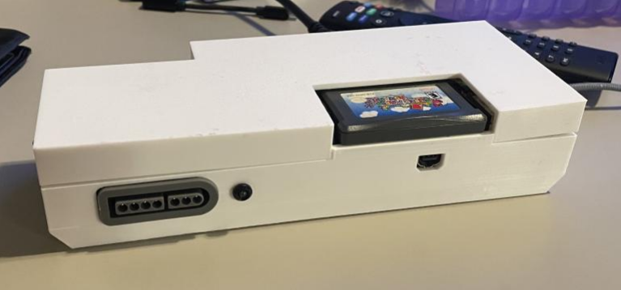
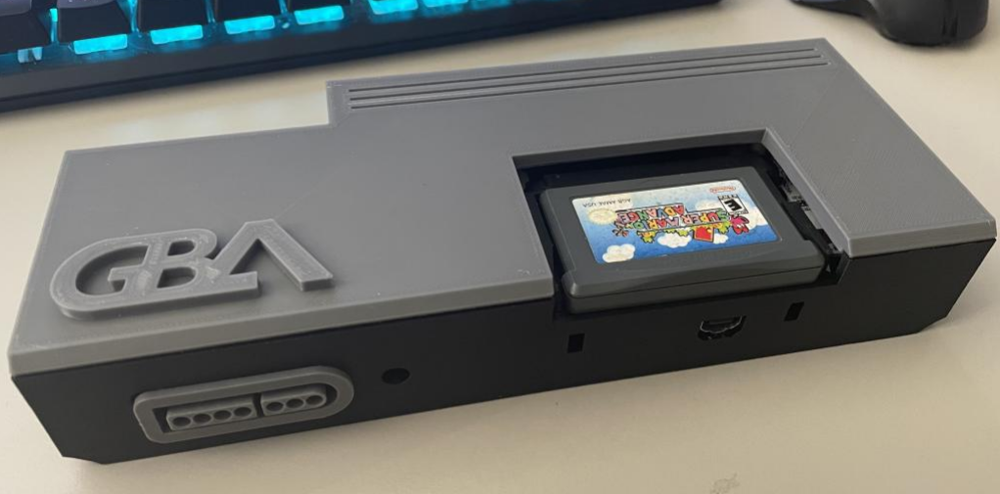

## Navigation

- [Home](../readme.md)
- [Expanded Introduction / Forward](introduction.md)
- [Image Gallery](gallery.md)
- [Materials Required](materials.md)
- [Printing Instructions / Suggestions](printing.md)
- [Assembly](assembly.md)
- [STL Index](../stl/readme.md)


# Expanded Introduction / Forward
This includes all of my thoughts around this project and various rants. If you're uninterested in reading this please feel free to skip along to the materials list.

## Who Am I?
I'm a Software Engineer from Raleigh NC and a retro gaming enthusiast. I own a few modded consoles and worship our lord and savior ***Lord Voultar*** ([Shop](https://voultar.com/), [YouTube](https://www.youtube.com/c/Voultar)). Unrelated, I'm also a cat girl omnicrafter in Final Fantasy XIV.

## Why Did  I Make This?
About six months ago I ordered a kit from game-tech.us and it finally came in. It came with the v2 kit (FFC/Flex Cables) and the Laser Bear Industries case. After getting the kit installed on the hardware itself it was time for assembly into the chassis.... That would end up being a disaster and send me down this rabbit hole of engineering this case.

## The Issues With Existing Cases

### Short Notice Before We Proceed
I want to be clear, I'm not putting down anyone's work  or their contribution to the community efforts. I (personally) appreciate everything everyone does to help move these projects along and makes things awesome. However, I think criticism is warranted to help make things better because feedback is rarely given around these projects.

---

### Laser Bear Industries Case
Case Link: https://www.laserbear.net/products/gba-consolizer-shell-laser-bear-version


*Source: Laser Bear Industries*

I want to say some positives first off before I really dive into what I dislike about this case.

- It was extremely well printed and clean.
- The components were well fit (too well fit, and we'll get into that in a moment).
- The case came with everything you needed to assemble it.
- They also provide STL so you can download it and print it at home: https://www.laserbear.net/pages/downloads

#### Problem 1: Too Tight of Fit, Tight Tolerances
Getting things in there is quite easy if you follow how to do it, however if something came loose or something is borked that you didn't noticed before assembly, good luck getting your components out of the case without breaking it in half (which is what happened eventually).

The part to assemble the back and the front where the SFC/SNES port is have to be perfectly align, the tolerances were so tight you had to really put force down on these to get them in and snap. I really dislike this, I would have much preferred a mounting setup that would require hardware.

#### Problem 2: The Power Switch
You know, the consolizer has a place to put pins for a DuPont connector or a surface mount switch so I find it absolutely wild that this case didn't have the clearance to do so. Furthermore- the power switch 'bracket' (the place on the side of the case to insert the PCB) is too hard to get to and too hard to assemble.

#### Problem 3: Design (Subjective)
I think it's an unattractive case and still has that project box feel. I'm not about it, I also don't like the power switch cover I think it's tacky and would have just preferred the power switch PCB to be mounted closer so I can just use the vanilla switch. However this opinion is on me and my tastes and there is nothing inherently wrong about it.

---

### Woozle's GBA Consolizer Enclosure
Case Link: https://www.thingiverse.com/thing:4522648


*Source: Laser Bear Industries*

**I actually really like this case** and after the debacle with the LB case I decided to print this one up at home (Note, prior to buying the kit months ago I didn't have a printer at the time, I do now). Let's get into what I like about this case:

- Pretty easy to print which is good (with some exceptions we'll get into that shortly)
- Pretty hefty and nice feeling (had some weight which was a complaint about the LB version)
- Hardware mounting for the consolizer PCB and the GBA PCB
- Well fitting but enough tolerances not to be a complete pain in the ass to reassemble and disassemble.
- Love the cart slot design (which would be carried over to this project)

However...

#### Problem 1 - Where Is The Documentation?
So currently on thingiverse the only thing mentioned is this:
```
Other parts:
10x4mm pin magnets (4)
10x2mm disc magnets(4)
6mm M2 screws (8)
```
This is great but:

1. Where do I source these pin/disc magnets? I scoured amazon for hours trying to find something that matches this and came up either confused or empty. I would like some examples as to what can be used so I can find the correct fitting items.
2. There is no talk about the power switch or button here. There is room for some sort of button (I've seen variations with a push button and ones with a toggle switch) but no clear definition on what I should purchase for the case.
3. What is the extra hole next to the power switch for? An LED power indicator?
4. This print will naturally build a bunch of supports that aren't required. Some guidelines on what should be supported and what shouldn't be (like overhang tolerances and angles) would be much appreciated.

#### Problem 2 - The Lid


While I appreciate that an SVG was given so I could make a plexiglass lid, I didn't want that personally. Now I know that [marcus9199](https://www.thingiverse.com/marcus9199) made a lid ([link](https://www.thingiverse.com/thing:4535786)) and it was *fine*, but again needed these mystery magnets to make it work work.

Just to note, I don't like magnets as a mounting hardware to begin with (This is the exact reason why I threw a Razor Naga in the trash some eight years ago). Furthermore an inset logo will always look worse printed than embossed, just the nature of FDM. I ended up making a lid modification with a thru-holes for screws and a cleaner logo as a result while I was trying to make this case work for me.

#### Problem 3 - Design  (Subjective)
Again, felt like a project box- but that is just on me.

#### Some Resolution - Modifications I Made To Make This Case Functional
I would end up making the following modifications so that I could use the case:

 - Made a new lid that could be screwed in so I didn't have to deal with magnets.
 - Gave the lid a new embossed logo so that it wouldn't look scuffed.
 - Removed the power button entirely in favor of USB inline power button (Much like one on a Raspberry Pi)
 - Fixed a problem with the model where  there was a missing line (I assume a seam) in the model.


These modifications would reduce the amount of headaches around the missing documentation and give me a complete console case that looked clean.

However I still wasn't satisfied after my work on this, it felt incomplete, this felt like a hack and I hated it.

## Designing A New Case

### Frustration Leads to Creation
After being effectively demoralized by all this work I did above, I ended up finally gaining the courage to just design a case from scratch. I had never done 3D CAD work before, however in a past life I used to be a engineer for architectural signage so a lot of that just kinda crossed over pretty seamlessly. The biggest challenge was finding software. I run Linux (Arch) because I mainly do development and Windows+Microsoft can fuck right off. However, this choice leaves me with very limited options for CAD software outside of going and buying a MacBook. Thankfully TinkerCad was more than enough to get the job done and to build out the part assembly.

### Case Design Goals
Before starting, just like any engineering project, I wanted to get my goals straight. Here is where my mind was at:

 - Can be printed on pretty much any basic FDM printer (The litmus test for this is an Ender 3, which is what I have)
 - Assembly and disassembly is easy and not frustrating. Using mounting hardware for the PCBs
 - Items required for the case should be easily available and be documented for those who wish to build it.
 - Have alternative options for those who might not want certain features in the case.
 - **Looks like a console**, remove the stacked design of the other two cases for something that looks more like something you would buy in a store.

### Design Inspirations
Look no further to console designs that sport the front-loading design. Elements of the NES and the PCEngine/TG-16 were massive inspirations for this project. However, since this also had an SNES/SFC port, I wanted some lingering elements of a SFC as well to bring it together.

### Design Challenges
- Woozle's flex cables are short in length, we will have to extend them to work in a flatter console design.
- Have enough tolerances for soldiering differences on the controller ports as well 3D print variation while not looking sloppy.
- Figure out the mounting mechanism for the lid and the base that would be easy to print and take on/off as needed.


### Early Designs / Prototypes
I first started off with a 2D drawing to get my head in the right place, below is an early example of the design.


From there I started modeling this design and picking apart parts of it to ensure form and fit.


At the end of it I would end up being a model something like this:


**I thought this would have been the end of it** ...however, it was not...



This design had a lot of challenges that maybe someone more technical could have overcame, but I was dissatisfied:

 - Case fit tolerances didn't go as expected, bowing in the case as a result of the screw mounts.
 - Converting injected molded design concepts into an FDM printed one wasn't a great idea for various reasons.
 - Furthermore it was entirely too difficult to print- the countersunk screw holes at the bottom were extremely problematic to print consistently and cleanly. The lid top was never cleanly printed despite how level my bed would be.
 - Screws would break in the mounting holes because of far too much torque required to put them in.

### Redesign and Compromise
 I would need to return to the drawing board after weeks of work and hours of printing prototypes.  Thankfully Elden Ring wasn't out yet so I wasn't distracted from my goal. After analyzing my failures and effectively botching some of the main goals, I decided to take this approach:

 - Remove screw mounting entirely from the base and lid. This not only made it hard to print, but made it horrible to assemble and was too complicated.
 - Make the lid snap on tension. This will make it easy to print and make it easy to remove. However it would need to be tight enough to pass the 'blizzard test'.

As a result of those compromises, this would end up being the final design:


It did, however take me like 6 different lid designs to get the form and fit right. The biggest issue is tolerances. I put in enough extra material on the lip to fit snugly and snap in, while not being an issue with the connectors for the LED and Power on the board itself.



The final prototype would make me very happy with the end result (though quite the deviation from the original design)

## Things I'm (Still) Dissatisfied With
While I'm extremely pleased with the design I did, there could be some improvements.

 - I hate the power switch. Originally I had it mounted inside where the mounting hardware would not be visible, unfortunately it is impossible to screw it in when the whole base is printed. As a result, to meet my goal of maintainability I went with mounting it on the outside. It's not hideous, but I wish it was nicer.
 - Tighten up some tolerances- the SFC port has some give to ensure depending on how exactly you mounted your port fits regardless, however it leaves some gaps. The lid could maybe use a bit more to snap more firmly into the case but I fear bowing of the lid as a result.

I may return to these in a revision if I get time or have the energy.

## The Last of It (Also a GBA HD Note)
This was a journey and over a month of work to get this functional and to my required spec. I'm pleased. If you have any suggestions or concerns please feel free to file it into the issues here in GitHub, I cannot promise I will get to them in a timely manor.

One last thing, this ephemeral `GBA HD` I keep seeing people talk about but I have no idea where to get one. **If someone wants to help me get my hands on one, reach out to me and I will be more than happy to make a revision of this case for that mod.** But until then, this is for Woozle's mod only.

