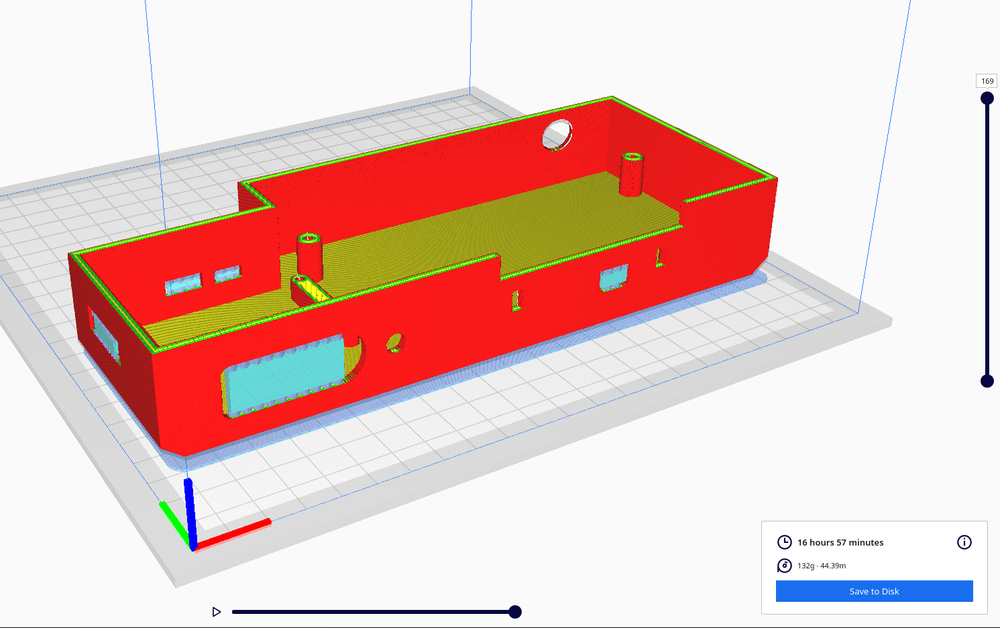
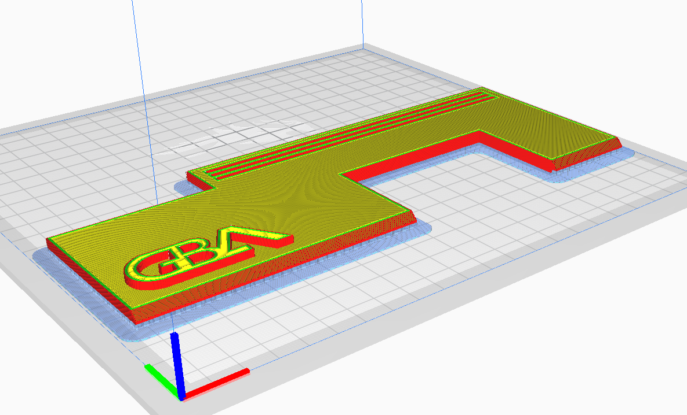

## Navigation

- [Home](../readme.md)
- [Expanded Introduction / Forward](introduction.md)
- [Image Gallery](gallery.md)
- [Materials Required](materials.md)
- [Printing Instructions / Suggestions](printing.md)
- [Assembly](assembly.md)
- [STL Index](../stl/readme.md)

# Printing Instructions / Suggestions
These are built around my Ender 3 V2 with a CRTouch- however they should work for nearly anyone who wants to print this. I used Ultimaker Cura to slice these prints, but any other slicer such as Prusa should also work just as well.

Also since I'm sure I'll give someone a migraine, I highly suggest printing these items on a **raft**. Yes you heard me, I will explain in further detail later why this is.

## Suggested Settings
|Property|Value|
|--|--|
| Cura Starting Profile | Super Quality
| Extrude | 0.2mm - 0.3mm |
| Extrude Temp | 200c (PLA)
| Bed Temp | 60c-62c (Glass) or 70c (PEI)
| In-Fill Density | 20-50% |
| In-Fill Pattern | Lines |
| Speed | 50/mm |
| First Layer Speed | 25/mm |
| First Layers | 4 |
| Supports | True
| Support Density | 5% |
| Minimum Support Area | 6mm |
| Support Overhang Angle | 80
| Adhesion | True
| Adhesion Type | Raft |
| Raft Margin | 5mm |
| Raft Air Gap | 0.45mm (This was for at .2 extrude for me, adjust accordingly) |


## The Base


*Picture:  Base 0.2mm Slice Shown with Raft*

The base is pretty straight forward. If you want to print without a raft more power to you, you will save time doing so. However if you're having adhesion problems or your bottom looks scuffed, a raft will solve your issues and no one cares about the bottom of your case.

You will notice with the support modifications lots of places without supports and that is intentional because it's overkill otherwise- **fun fact**, you could print this entirely without supports too- I did it sometimes during prototyping and it worked, but you might get some sagging from the SNES/SFC port sometimes. The settings I recommend are easy to remove yet provide good support to the places that need it.

## The Lid

*Picture: Lid 0.2mm Slice Shown with Raft*

**The lid should absolutely be built on a raft no exceptions.** Why? it makes it so easy to just rip off the supports. In one peel everything  should come off. And if you're using the no logo variation you might think you're clever to flip it around and print face down- unless you have a perfect bed, with perfect leveling, with perfect heat and adhesion you will get a scuffed face and warping. The best thing to do is raft it and call it a day.

## Some 3D Printing Tuning Resources
Despite its looks, it can be a hard print because of its size and density. However, I honestly recommend these videos and tools to help tune in your 3D printer before getting to work:

https://teachingtechyt.github.io/calibration.html

## (Extra) Good BLTouch Start Code for Ender 3
This is what I use for most of my prints, I stole it from reddit somewhere, I am owed no credit. Just place this in your printer settings in your slicer.

```
; Ender 3 Custom Start G-code
M140 S{material_bed_temperature_layer_0} ; Set Heat Bed temperature
M190 S{material_bed_temperature_layer_0} ; Wait for Heat Bed temperature
M104 S160; start warming extruder to 160
G28 ; Home all axes
G29 ; Auto bed-level (BL-Touch)
G92 E0 ; Reset Extruder
M104 S{material_print_temperature_layer_0} ; Set Extruder temperature
G1 X0.1 Y20 Z0.3 F5000.0 ; Move to start position
M109 S{material_print_temperature_layer_0} ; Wait for Extruder temperature
; G1 Z2.0 F3000 ; Move Z Axis up little to prevent scratching of Heat Bed
G1 X0.1 Y200.0 Z0.3 F1500.0 E15 ; Draw the first line
G1 X0.4 Y200.0 Z0.3 F5000.0 ; Move to side a little
G1 X0.4 Y20 Z0.3 F1500.0 E30 ; Draw the second line
G92 E0 ; Reset Extruder
G1 Z2.0 F3000 ; Move Z Axis up little to prevent scratching of Heat Bed
; End of custom start GCode
```
