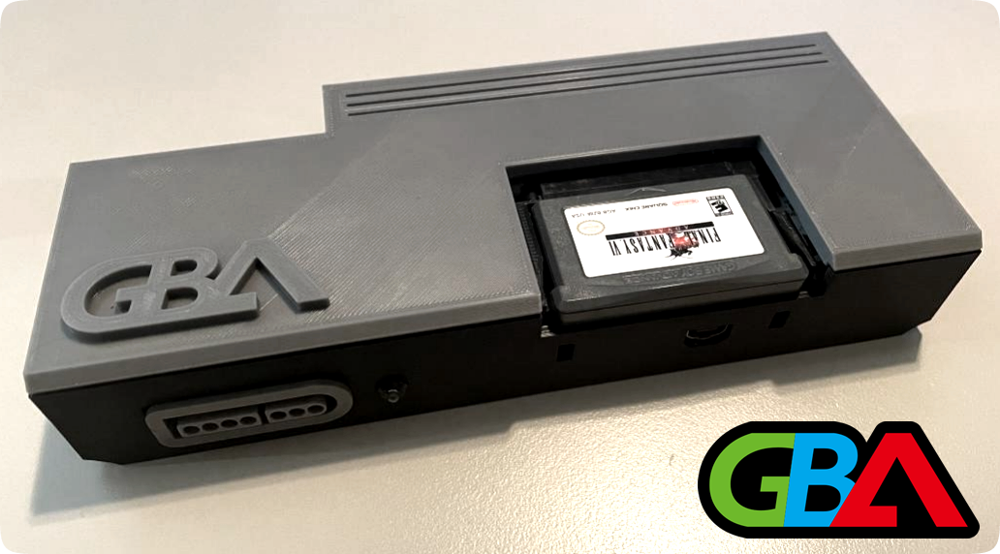

# GBAlpha - *A Console-Like Case for Woozle's GBA Consolizer*

## Introduction
Included in this repository is a custom case design for Woozle's GBA Consolizer. This has a more console-like feel and has inspirations from various design choices from the PCEngine and NES. This case was designed around the maintainability of components inside being easy to disassemble and assemble and, unlike other available cases, this is a complete project with documentation, assembly, and printing instructions. If you want to know more around my thoughts and this project please read my forward [here](docs/introduction.md).

## Table of Contents
- [Expanded Introduction / Forward](docs/introduction.md)
- [Image Gallery](docs/gallery.md)
- [Materials Required](docs/materials.md)
- [Printing Instructions / Suggestions](docs/printing.md)
- [Assembly](docs/assembly.md)
- [STL Index](stl/readme.md)

## How To Download
Click `code` at the top and `Download Zip`, or if you're a champion checkout with `git`.

## Donate
If you like this project and want to help me stay caffeinated you can donate here: https://www.paypal.com/donate/?hosted_button_id=852RXAG6BF8Y8

## Disclaimer
This project isn't endorsed or supported by Woozle or anyone affiliated with the GBA consolizer or related projects like the GBA HD. This is my own thing. Don't go asking anyone else for support or help with this case and its designs. Thanks.

## General License

This work is licensed under a [Creative Commons Attribution-NonCommercial-ShareAlike 4.0 International License](http://creativecommons.org/licenses/by-nc-sa/4.0/).
