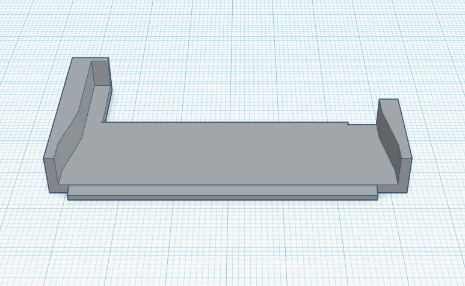
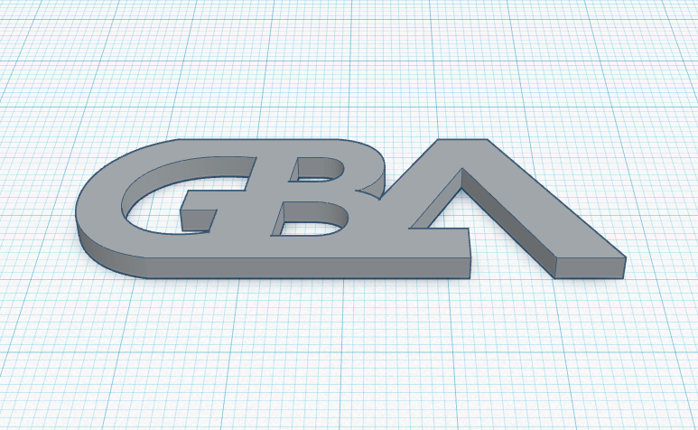
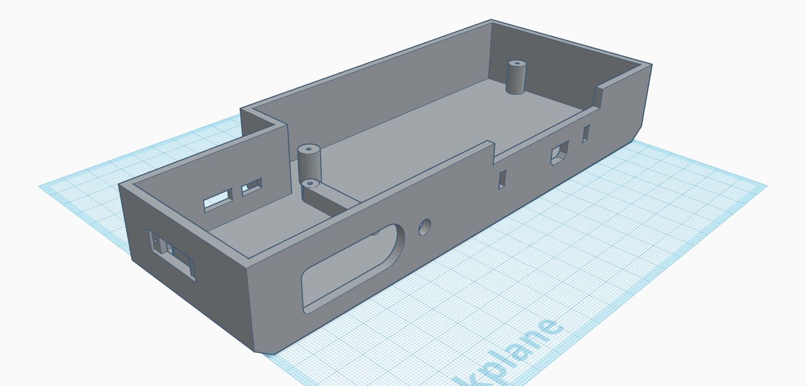
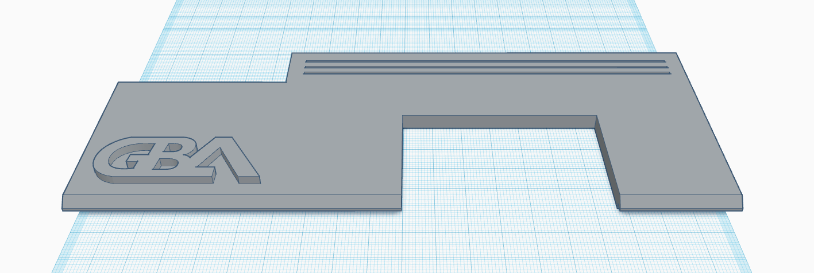
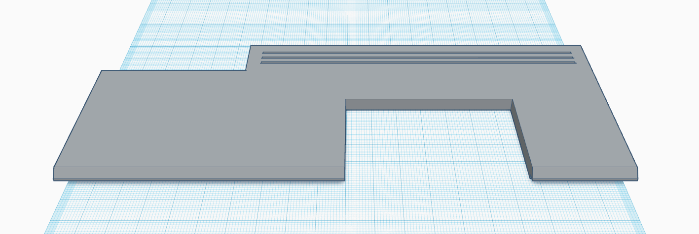

# STL Index

## Disclaimer
While you could just come in here and wing it, I highly recommend reading the [documentation](../readme.md) before throwing this into a slicer and having a go at it. This is a large print and a lengthy one at that. However, you do you.

## ./
### Cart Slot `cartslot.stl` (Required)

This is Woozles cart slot model. This case reuses this part from that case as it was a pretty clean way of making a cart slot. You will need to print this for full assembly.

### GBA Logo `logo.stl` (Optional)

This logo is to be paired with the lid with no logo so could have have two colors on your lid.

## ./bases
### Base Full `base-full.stl` (Recommended Variation)

This includes everything of the base base, the GBA game link adapter slits, microphone jack in the back, etc.

### No GBA Game Link `base-no-gba.stl` (Optional Variation)

This variation of the base has no slits for the GBA link cable accessories though still provides the GB link cable port. Outside of maybe the infrared adapter, you're likely not going to be sitting with two TVs or switching inputs to play four swords or search for Triforce pieces in Wind Waker. This is makes the front of the case much cleaner and is a good variation for those who don't care about GBA connectivity.

### No Microphone Port `base-no-mic.stl` (Optional Variation)

This variation of the base has no microphone port on the back. This is provided to those who don't need access to it and DVI+ works just fine and want a cleaner back.

### No GBA Game Link & No Mic `base-no-gba-no-mic.stl`  (Optional Variation)

Combines the no microphone port and the lack of GBA game link slits.

### Absolute Minimalism `base-minimal.stl` (Optional Variation)

Removes GBA game link slits, LED hole, microphone jack, and power switch. Truth be told when I originally was just modifying Woozle's case this was what I was aiming for so I could just not have to do any work and just get a USB PSU with a power switch on it (Like one used for a Raspberry Pi). This is a minimum effort and minimum part case and all you'll need outside of the mod itself is eight (8)  `M2*6` screws.

**Note:** To use this variation you will need to solder bridge the first two (left to right) pads of the power switch area (P2 and P3) on the PCB so that when it is plugged in it will stay on. Honestly trivial thing to do considering you already did the rest of the mod.

## ./lids
### Lid With Logo `lid-full.stl` (Recommended Variation)

This comes with the GBA logo on the top already embossed on.

### Lid With Without Logo `lid-no-logo.stl` (Optional Variation)

This is the same lid but without the logo. You could just print this and use it without a logo at all OR you could print the logo by itself (see `./logo.stl`) in another color and glue/attach it to this lid to make a duotone lid. Alternatively if you have an IDEX 3D printer you could just combine those two models and print with two colors.

